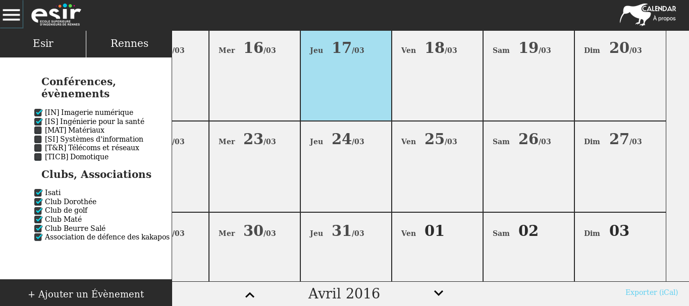
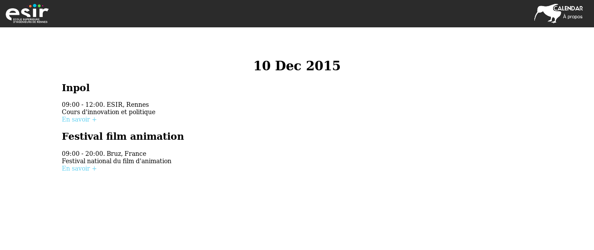
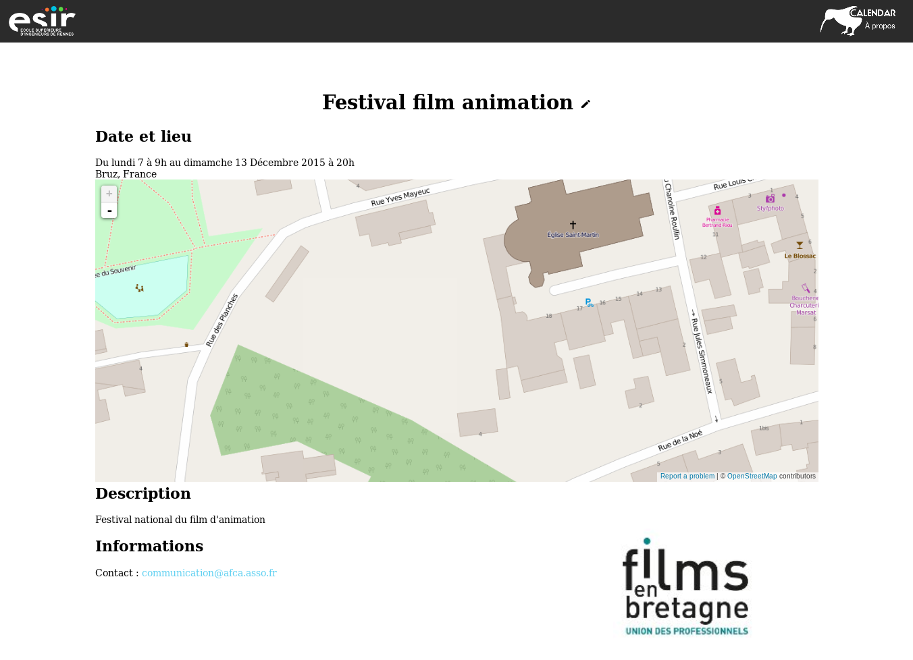
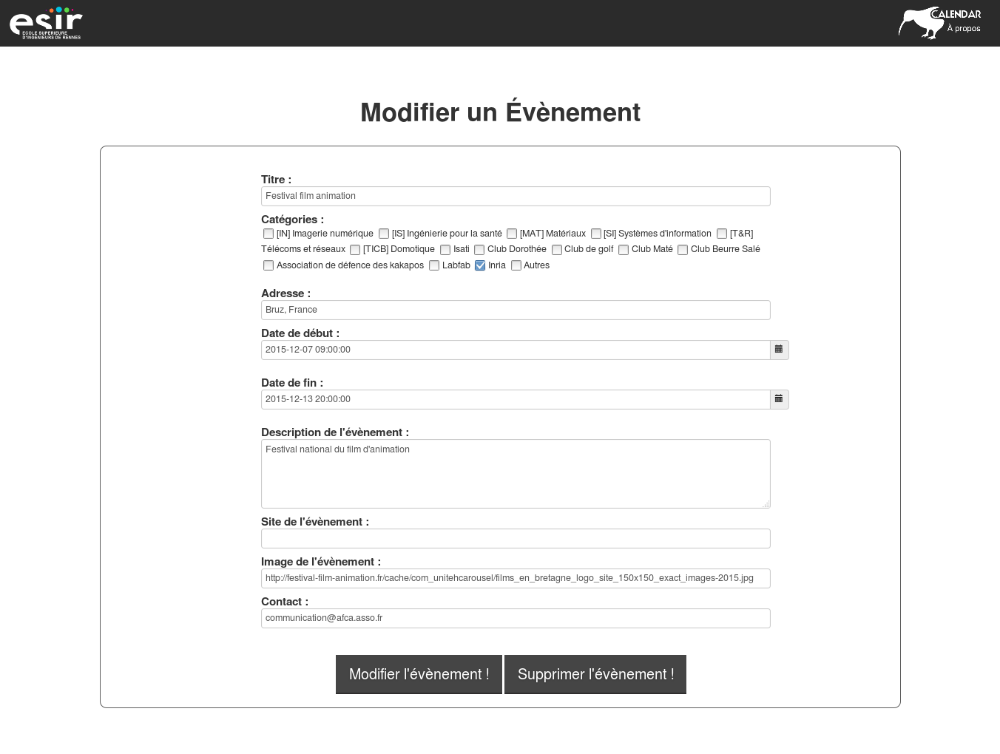

# KiWi-calendar

1. [Le projet](#Le-projet)
2. [A quoi ça ressemble ?](#À-quoi-%C3%A7a-ressemble-)
3. [Qui ?](#qui)
5. [Licence](#licence)

## Le projet

L'ESIR et les Esiriens participent à de nombreux évènements. De plus, la ville de Rennes est très active et propose chaque semaine des évènements dans de nombreux domaines. Pour le moment, ces évènements sont enregistrés dans des calendriers distincts, ou envoyés par mail, ou dans des groupes privés (par exemple, pour les clubs de l’ESIR, il faut soit s’adresser à une personne du club, soit utiliser un outil externe).  
L’idée est donc de proposer un calendrier semi-collaboratif disponible en ligne regroupant des évènements intéressants :

- De base, les évènements internes à l’école ainsi que ceux du BDE (soirées, réunions des clubs, etc) seront synchronisés. De plus, de nombreux évènements rennais seront synchronisés (Diapason, Concerts, opéras, théatres, cinéma, etc.)
- De plus, chaque étudiant pourra ajouter un évènement potentiellement intéressant pour les étudiants (une conférence intéressante, un évènement comme le stunfest, etc). (La modération des évènements est un point à travailler)

Ce calendrier sera disponible directement à partir du site de l’[Isati](http://isati.org) et sera exportable dans de nombreux formats. Nous pouvons aussi imaginer un affichage du calendrier directement sur la télévision du hall de l’ESIR.

## À quoi ça ressemble ?

## Qui ?

Ce projet a été initié et réalisé par 4 étudiants à l'ESIR dans le cadre du module Innovation et Politique :

+ Sébastien Blin
+ Merwan Kaf
+ Amaury Louarn
+ Paul Perraud

## Licence

Ce projet est sous licence [CeCILL 2.1](http://www.cecill.info/licences/Licence_CeCILL_V2.1-fr.txt)
